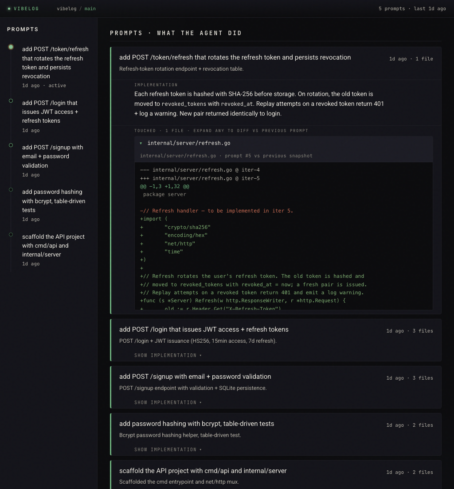

<h1 align="center">
  🎚️ vibelog
</h1>

<p align="center">
  <b>A log for vibe coding.</b><br/>
  Every prompt the agent answered, every file it touched, on one page.
</p>

<p align="center">
  <a href="#install"></a>
  <a href="LICENSE"></a>
  <a href="https://github.com/friday-james/vibelog"></a>
</p>

<p align="center">
  
</p>

---

## What it is

A small dashboard that records every assistant turn from your AI coding sessions and shows them as a list. Click a prompt to see what the agent said back, which files it touched, and the diff for each one.

No daemon, no DB, no telemetry. It writes plain JSONL into `.sync/` next to your repo and serves a single page on `localhost:7100`.

---

## Why

If you let an agent move fast, you stop remembering what it touched. vibelog gives you the receipts: every prompt you sent, every reply, every file edited, kept in chronological order so you can scroll back and audit a session the same way you'd `git log`.

---

## Install

Requires Go 1.25+, [Claude Code](https://claude.ai/code), git.

```bash
git clone https://github.com/friday-james/vibelog
cd vibelog
go install ./cmd/vibelog
```

That puts `vibelog` on your `$PATH` (assuming `~/go/bin` is on it).

### Set up a project

```bash
cd /path/to/your/repo
vibelog init        # creates .sync/ skeleton
vibelog serve &     # dashboard on http://localhost:7100
```

### Wire the Stop hook (records every assistant turn)

Add this to `~/.claude/settings.json`:

```json
{
  "hooks": {
    "Stop": [
      {
        "matcher": "",
        "hooks": [{ "type": "command", "command": "vibelog observe" }]
      }
    ]
  }
}
```

If `vibelog` isn't on the PATH that Claude Code spawns hooks with, use the absolute path: `/Users/you/go/bin/vibelog observe`.

### (Recommended) MCP server for deterministic teach-backs

```bash
claude mcp add vibelog vibelog mcp
```

This registers a `set_implementation` tool. When the agent calls it, the curated summary + response text are saved *during* the turn — sidestepping the race where Claude Code flushes the assistant's reply to the transcript after the Stop hook has already read it. Without this, vibelog falls back to a transcript-tail heuristic that loses on longer Q&A turns.

---

## How it works

```
                  ┌─────────────────┐
   you ──prompt──▶│   claude code   │──response──▶ you
                  └────────┬────────┘
                           │ Stop hook
                           ▼
                  ┌─────────────────┐
                  │  vibelog observe│ ── writes one row ─▶ .sync/iterations.jsonl
                  └─────────────────┘
                                              │
                                              ▼
                                     ┌─────────────────┐
                                     │  vibelog serve  │
                                     └────────┬────────┘
                                              │ HTTP
                                              ▼
                                    http://localhost:7100
```

Every assistant turn becomes one row in `.sync/iterations.jsonl` and one card on the dashboard. The card expands progressively:

| Tap | Reveals |
| --- | --- |
| **L0** | The user prompt + a one-line subtitle of what the agent did |
| **L1** | `show response` (Q&A) or `show implementation` (file-touching) — the curated teach-back |
| **L2** | `show files touched` — paths the agent edited this turn |
| **L3** | `show diffs` — per-file unified diff vs the snapshot from the previous touch |

The data is plain JSONL. You can `cat .sync/iterations.jsonl | jq` it any time.

---

## Project layout

```
cmd/vibelog/                CLI: init, mcp, observe, serve, watch, ingest-git
internal/
├── model/                  Iteration, Anchor — typed schema
├── store/                  reads .sync/ — tolerant of unknown row kinds
├── observecmd/             Stop-hook handler (transcript → row)
├── mcpserver/              MCP tools (set_implementation, …)
├── serve/                  HTTP server + embedded UI
├── gitcmd/                 walks git log (optional ingest-git subcommand)
├── initcmd/                scaffolds .sync/
└── watchcmd/               tails .sync/iterations.jsonl in the terminal
.sync/                      per-project state (add to .gitignore)
├── anchor.yaml             project intent — optional, mostly informational
├── iterations.jsonl        one row per assistant turn
└── snapshots/iter-N/...    file contents at iter N (used by the diff endpoint)
```

---

## Status

Early. Daily-driven by the author against `claude code` on a Mac. Codex support, manual-edit drift detection, and git-tree snapshots are in the design pile but not in the binary yet. Issues and PRs welcome.

---

## License

MIT.
